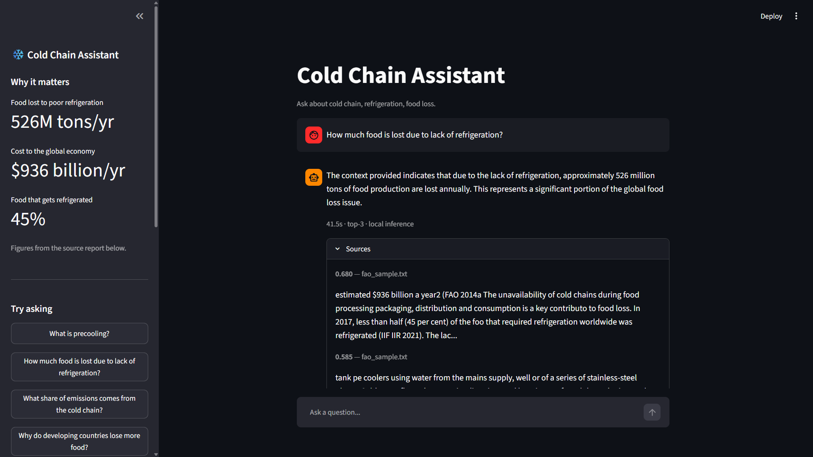
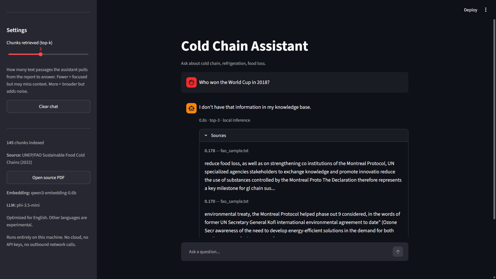

# Cold Chain Assistant - Local RAG

A document Q&A assistant that runs entirely on your own machine. It answers questions about cold chain and refrigeration by retrieving passages from a source report and grounding the model's answer in them.

Everything runs on your machine: no cloud service, no API keys, and no network calls once the models are downloaded.

Built with [Microsoft Foundry Local](https://learn.microsoft.com/en-us/azure/foundry-local/) for on-device inference.

---

## What it does

- Answers questions from a local document collection using Retrieval-Augmented Generation (RAG)
- Grounds every answer in retrieved passages and shows them with similarity scores
- Refuses to answer when the knowledge base doesn't cover the question, instead of guessing
- Runs fully offline on the CPU without a GPU

---

## Demo

A short screen recording of the assistant answering a grounded question and refusing an out-of-scope one:


https://github.com/user-attachments/assets/03cf94c6-b852-426a-8054-29a497d8bb60


---

## Screenshots

**Grounded answer with retrieved sources**



**Refusing an out-of-scope question**



The refusal happens in under a second because the retrieval score falls below the threshold and the model is never called.

---

## Architecture

```
Indexing (offline, run once)
  PDF → text extraction → chunking → embeddings → SQLite

Querying (per question)
  question → embedding → cosine similarity → top-k chunks
                                                  ↓
                              score threshold check
                                    ↓                ↓
                              too low            good enough
                                    ↓                ↓
                              refuse         LLM + context → answer
```

Indexing runs once and persists to SQLite, so startup doesn't re-embed the corpus. At query time the question is embedded with the same model, compared against every stored chunk vector, and the top matches become the model's context.

---

## Tech stack

| Component | Choice |
|---|---|
| Local inference runtime | Microsoft Foundry Local |
| Embedding model | `qwen3-embedding-0.6b` (1024 dimensions) |
| Chat model | `phi-3.5-mini` |
| Vector + text store | SQLite (embeddings as float32 BLOBs) |
| UI | Streamlit |
| PDF extraction | pdfplumber |

---

## Project structure

```
rag.py         Shared RAG logic - model loading, retrieval, answer generation
extract.py     PDF → text extraction with two-column handling
ingest.py      Chunking, embedding generation, SQLite storage
app.py         Streamlit web interface
ask.py         Command-line interface
evaluate.py    Test suite
```

---

## Setup

```bash
winget install Microsoft.FoundryLocal

python -m venv venv
venv\Scripts\activate
pip install -r requirements.txt
```

Requires Python 3.11+ and at least 8 GB RAM.

> On Windows, install `foundry-local-sdk` (not `foundry-local-sdk-winml`) unless you have a DirectX 12 GPU. The two packages have conflicting `onnxruntime` dependencies.

---

## Usage

**1. Build the knowledge base** (run once, or whenever documents change)

```bash
python extract.py    # PDF → docs/fao_sample.txt
python ingest.py     # chunk, embed, store in SQLite
```

**2. Ask questions**

```bash
streamlit run app.py     # web interface
python ask.py            # command line
```

The first run downloads the models (a few minutes). After that they load from cache and work offline.

---

## Knowledge base

**Source:** UNEP and FAO. 2022. *Sustainable Food Cold Chains: Opportunities, Challenges and the Way Forward.* Nairobi, UNEP and Rome, FAO. https://doi.org/10.4060/cc0923en

Licensed under CC BY-NC-SA 3.0 IGO. Chosen because it is openly licensed, requires no permission to use, and covers a real industrial domain.

Currently indexed: **145 chunks** (~200 words each, 30-word overlap) from pages 20-70 of the report.

---

## Evaluation

The system is tested against 10 questions in two categories: six the report **can** answer, and four it **cannot**. The metric is whether the system behaves correctly: it should answer when it has grounding and refuse when it does not.

```
[PASS] (answerable,   top=0.686) What is precooling?
[PASS] (answerable,   top=0.680) How much food is lost due to lack of refrigeration?
[PASS] (answerable,   top=0.666) What share of global emissions comes from the cold chain?
[PASS] (answerable,   top=0.582) Why do developing countries lose more food?
[PASS] (answerable,   top=0.730) What is the difference between precooling and cold storage?
[PASS] (answerable,   top=0.597) How does refrigeration relate to food safety?
[PASS] (unanswerable, top=0.178) Who won the World Cup in 2018?
[PASS] (unanswerable, top=0.233) What is the capital of France?
[PASS] (unanswerable, top=0.222) How do I bake sourdough bread?
[PASS] (unanswerable, top=0.263) What is the price of Bitcoin?

Score: 10/10 correct behavior
```

### The finding behind the threshold

The first version scored **6/10**. All six answerable questions passed, but all four unanswerable ones failed. The model invented answers about the World Cup, Bitcoin prices, and sourdough recipes despite retrieval scores under 0.27.

Prompt instructions alone did not fix this. Smaller models do not reliably follow "use only the provided context."

The fix was to stop relying on the model's judgment and enforce the rule in code: if the best retrieval score falls below a threshold, refuse before calling the model at all.

The threshold value came from the data. Answerable questions scored 0.58-0.73; unanswerable ones scored 0.17-0.26. **0.35** sits in the gap and separates them cleanly. Score after the change: **10/10**.

---

## Design decisions

**SQLite over a vector database.** The corpus is small enough that brute-force cosine similarity over 145 vectors is instant. SQLite is a single file, needs no server, and ships with Python. A dedicated vector database (FAISS, Chroma) would be the right call at a larger scale.

**float32 BLOBs for embeddings.** SQLite has no vector type. Storing `numpy` arrays as raw bytes at float32 halves the space of Python's default float64, and the precision loss is irrelevant for similarity search. 1024 dimensions × 4 bytes = 4 KB per chunk.

**Model selection is a speed/accuracy tradeoff.** Four models were tested on the same questions:

| Model | Response time | Numeric accuracy |
|---|---|---|
| `qwen2.5-0.5b` | ~7s | Fabricated figures |
| `phi-3.5-mini` | ~40s | Correct |
| `qwen3-1.7b` | ~81s | Correct, slightly richer |

`qwen2.5-0.5b` was six times faster but invented "144 million tons" where the source says 526 million. `qwen3-1.7b` was accurate but doubled the wait due to reasoning-mode overhead. `phi-3.5-mini` was chosen as the point where correctness is reliable and latency stays tolerable.

**Chunking at ~200 words with 30-word overlap.** The overlap prevents information from being lost at chunk boundaries. A sentence split across two chunks still appears whole in at least one.

---

## Known limitations

**PDF extraction quality.** The source report uses a two-column layout. Column-aware cropping fixed most pages, but its boxed sections use a different layout and still produce interleaved text. For example, a passage reads "It requires high weight loss from products" where the original says "high-capacity refrigeration to minimize weight loss." Answers built on those chunks inherit the error. This is the single largest source of remaining quality issues, and it is a data problem rather than a model problem.

**Small-model precision.** `phi-3.5-mini` handles conceptual questions well but sometimes under-answers on figures. Asked for the cold chain's share of global emissions, it says the context doesn't specify, though the report states roughly 4 per cent. Under-answering is safer than fabricating, but it is still a miss.

**Evaluation measures behavior, not accuracy.** The test suite checks whether the system answers or refuses appropriately. It does not verify that the answer content is factually correct. A fabricated figure inside an otherwise well-formed answer would still pass. This gap is how the "144 million tons" error initially went unnoticed.

**English only in practice.** The knowledge base is English and the system is tuned for English questions. Cross-lingual retrieval scores roughly 0.15-0.20 lower, and answer quality in other languages degrades noticeably.

**Latency.** Around 40 seconds per answer on CPU. Foundry Local offers no GPU variant for the hardware this was built on, so all inference runs on CPU.

---

## Future work

- Layout-aware PDF extraction to fix the boxed-section interleaving
- Extend the test suite with expected-keyword assertions so factual errors fail the run
- Add page numbers to citations so answers can be traced to a specific page
- Re-ranking with a cross-encoder to improve retrieval precision
- Multilingual embedding model for non-English queries

---

## License and attribution

Code in this repository is provided for educational purposes.

Knowledge base content: UNEP and FAO. 2022. *Sustainable Food Cold Chains.* Licensed under CC BY-NC-SA 3.0 IGO.
